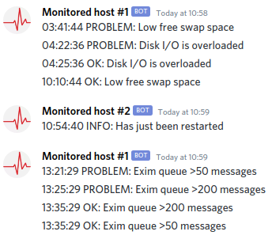
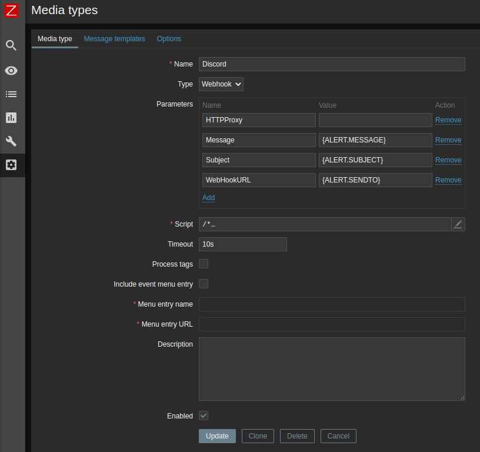
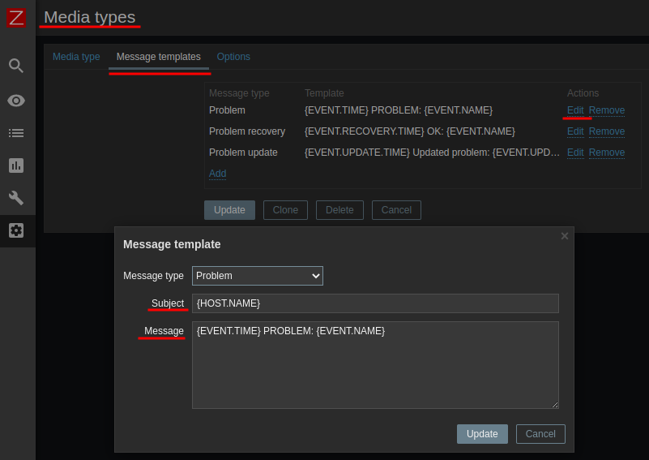
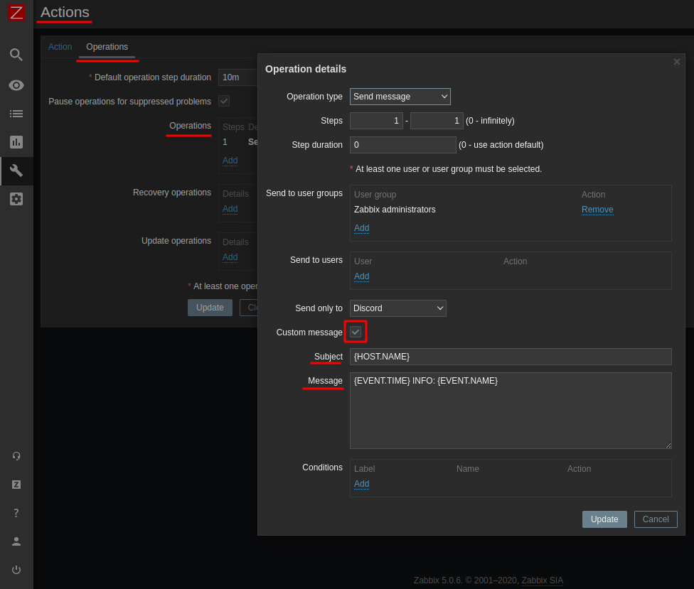

zabbix-webhook-scripts
======================

JS script files to use in Zabbix for Webhook Media type

discord-script.js
-----------------

WebHook script with minimalistic information output. Host name from Zabbix is used in field "username" of webhook. It causes grouping of alerts from the same monitored host.\
Tested on Zabbix 5.0 (LTS).

Script errors will be writen to zabbix-server.log\
For debugging content of requests and responses can be logged to zabbix-server.log by changing logging level of Zabbix server or script only (see comments in code).

#### Installation

Create new Media type with Type = "Webhook":

* **Name**: Discord
* **Type**: Webhook
* **Script**: Copy content of file **discord-script.js**

*Parameters*:
  * **HTTPProxy**
  * **Message**: `{ALERT.MESSAGE}`
  * **Subject**: `{ALERT.SUBJECT}`
  * **WebHookURL**: `{ALERT.SENDTO}`

Next step is "Message templates" for new Media type.\
Point is that this alerting channel needs one line messages.

Subject: `{HOST.NAME}`

Message:\
`{EVENT.TIME} PROBLEM: {EVENT.NAME}`\
`{EVENT.RECOVERY.TIME} OK: {EVENT.NAME}`\
`{EVENT.UPDATE.TIME} Updated problem: {EVENT.UPDATE.MESSAGE}`\

Theese will be a default messages using Discord as Media.\
If you need some custom message it can be done editing Action. Just set "Custom message" checkbox on "Operation details" page.\
I.e. I use it for triggers with severity "Information", because I don't need "Recovery message" for them (i.e. server reboot or file content changed).

Subject: `{HOST.NAME}`\
Message:`{EVENT.TIME} INFO: {EVENT.NAME}`

#### Credites and copyrights
Original code I took from official [Zabbix sources](https://git.zabbix.com/projects/ZBX/repos/zabbix/browse/templates/media/discord).\
Code was changed from Zabbix 4.4 to 5.0 (some JS objects changed).

